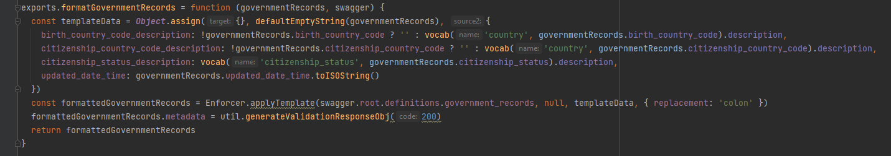
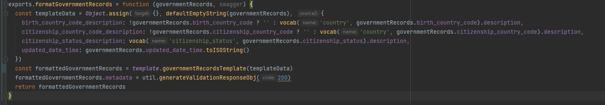

# Swagger Fastify Generator

#### This is a tool to generate boilerplate code from an existing swagger document to facilitate the conversion from SansServerSwagger/OpenAPIEnforcer with Express to Fastify

## Convert SansServerSwagger/OpenAPIEnforcer with Express to Fastify

### Step 1: Install this Tool
1. Run: ```npm i -g swagger-fastify-gen```

### Step 2: Use Tool to Generate Boilerplate Code
1. Navigate to the directory in the API that contains your `swagger.json` file.
2. Run ```fastgen```
3. Choose from the [list of options](#fastgen-options) to create the configuration that best fits your code.
4. Verify that a `gen` directory was created in your working directory. 

### Step 3: Convert Templating Functions

Many of our older APIs use SansServer or OpenAPIEnforcer to template the response JSON, especially when the API uses the [UAPI specification](https://github.com/byu-oit/UAPI-Specification/blob/master/University%20API%20Specification.md).

This has proven itself to be a bad pattern and in the future we would prefer to write our own functions that return the response JSON with the correct format. This section will explain how to do that using the code generated by the tool. 

1. Find the code that is performing the formatting. This code can often be found in a directory called `format` in a file called `index`. 
2. In the file, you should see functions like the one below:



Notice what this function does. It takes the data (governmentRecords) and the swagger object as parameters. It then changes the data to the format the swagger expects (usually it just changes the name of a property). It then uses the enforcer to apply the template that the swagger expects.

4. Find the [templating](#code-generated-by-fastgen) file in the code that was generated by the tool. Copy the `templating` file into the same directory as the formatting file. 
5. Import the templating file at the top of the formatting file with `const template = require('./templating)` or `import templating from './templating`.
6. For each formatting function in the formatting file, remove the call to the swagger enforcer templating function and replace it with a newly generated templating function.
7. Remove any unused functions from the `template` file. 

For example, the code shown above would be converted to:



7. After converting each function, use Postman to test an endpoint that calls that formatting function. Ensure that there are no errors.
8. At this point, after testing that the functionality remains unchanged, you can push the code to dev/prd.

## Step 4: Create a Temporary Development Environment with Terraform
I won't go into full detail on how to do this, but it is ideal to have a separate, non-local environment for testing a change as large as this. Create that with terraform and change the `./github/deploy.yml` file to deploy when to this environment when you push to your temp branch.

## Step 5: Move Schema Files
1. Move the [constants](#constants), [DefinitionSchemas](#definitionschemas), [ParameterSchemas](#parameterschemas), and [ResponseSchemas](#responseschemas) files into a new directory called in the API code called `models`

## Step 6: Setup Fastify Routes
There should be an existing directory called `routes` that contains the code that is hit when any given endpoint in the API is called. Each function in this directory was linked to its endpoint by SansServer or OpenAPIEnforcer.

In order to make this conversion as simple as possible, we are going to leave all this code unchanged and simply import each function into the route endpoint that was generated by the tool. This pattern makes the conversion very simple and keeps us from having to rewrite all the route tests. 

1. Rename the current `/routes/` directory to `controllers`
2. Copy the [generated routes](#code-generated-by-fastgen) into the API source code. They should have the correct directory structure.
3. For each file in the generated routes directory:
   - Modify the Schemas we are importing so that they come from the `/models/` dir where we just placed them.
   - For route function in the file:
     - Import and use the `/controller/` function that corresponds with the functionality you are converting and pass in the fastify request and reply objects as arguments to the imported function.

4. If there is a `tests/routes/` directory, each file will need to go from importing `/routes/<function-name>` to `/controllers/<function-name>`

## Step 7: Create Healthcheck Plugin

1. Create a `plugins` directory in the API code. 
2. Create a `healthcheck` file in the `plugins` directory. 
3. See the [example healthcheck plugin code](#example-healthcheck-plugin)

## Step 8: Create a Fastify Server File
You will need to create a server file that performs all the same actions as the current express server file, but for fastify. See an example [here](#example-server-file).

Note that the example uses the `@fastify/autoload` plugin to load both the `routes` and `plugins` from their respective directories.

## Step 9: Misc
Here is a list of other random things to look out for in the conversion: 

1. Search the entire project for `res.set`. Any instances of `res.set` in express should be changed to `res.header` in fastify.

## Step 10: Test Locally
You should now be able to spin up a fastify server locally and test it locally. Test every endpoint against the old API to ensure a correct conversion.

## Step 11: Fix Postman Healthcheck
Most of these APIs use Postman to test their health endpoints in the CodeDeploy phase of deployment. You will need to tweak this process to ensure a successful deployment. 

1. Verify that a `.postman` directory exists in the API. 
2. There should be json files corresponding to the existing environments (dev and prd) in the dir. Create new files for your temp environment. Note that you can just copy and paste from the existing files and change the URL being called.
3. There should also be a json file that corresponds to the name of the API (something like `ces-adm-sv-ensign.postman_collection.json`). Edit this file to more closely match the [example postman healthcheck file](#example-postman-test-file). We do this because the healthcheck no longer returns just a string, it returns an object.

## Step 12: Test in the Cloud
You can now push to your temp branch which should automatically deploy to your temp environment. Fix any deployment issues and then thoroughly test the API in the cloud using Postman. 

## Step 13: Make a PR and Merge to dev/prd
Once you are sure that the API works, make a PR. Have someone review the PR. You can then merge the PR to dev and eventually prd. 

## Step 14: Remove Temp Environment and Branch
Every reference and resource of the temp environment you created should be destroyed. This includes:

1. Terraform destroying the temp resources.
2. Deleting the temp terraform files.
3. Deleting the temp `.postman` files.
4. Removing any reference to the temp branch from the `.github/deploy.yml` file or anywhere else.
5. Merge your changes into dev and prd

## Conclusion
 You have now converted an API from an old framework to our newest pattern. Congrats!

## Code Generated by FastGen

### /routes/
This outputs subdirectories with 

### DefinitionSchemas
This file includes typeBox schemas for all the swagger definition objects.

### ParameterSchemas
This file includes typeBox schemas for all the swagger paramter objects.

### ResponseSchemas
This file includes typeBox schemas for all the swagger response objects.

### constants
Currently, this file only includes a `tags` enum that is used in all of the routes. 

## FastGen Options

## Example Server File

```
const { logger } = require('./util/logger')
const Fastify = require('fastify')
const { join } = require('path')
const AutoLoad = require('@fastify/autoload')

/***
 * Creates a server for the app
 * @param options the fastify options
 * @param db pass in an instance of the Db class created in index.js
 * @param authenticate tells the app whether to run requests through the token validation middleware or not
 * @param authorize tells the app whether to run requests through the whitelist check or not
 */
async function start () {
  const fastify = Fastify({
    logger
  })

  const basePath = '/domain/applications/ldsbc/admission'

  // This loads all plugins defined in plugins
  fastify.register(AutoLoad, {
    dir: join(__dirname, 'plugins')
  })

  // This loads all plugins defined in routes
  // define your routes in one of these
  fastify.register(AutoLoad, {
    dir: join(__dirname, 'routes'),
    options: { prefix: basePath }
  })


  const port = process.env.PORT || 8080
  const app = await fastify
  await app.listen({
    host: '0.0.0.0',
    port
  })
}

start()

```

## Example Healthcheck Plugin

```
const fp = require('fastify-plugin')
const { HealthCheck, Status, noopExecutorFactory, healthCheckFastify } = require('@byu-oit/healthcheck')
// Uses the @byu-oit/healthcheck plugin https://github.com/byu-oit/healthcheck to automatically provide health checks
module.exports = fp(async function (fastify, opts) {
  const version = '1' // public version of the service
  const releaseId = '1.0.0' // release number of the service

  // is_alive health check
  const healthCheck = new HealthCheck({ info: { version, releaseId } })
    .add('noop', 'alive', noopExecutorFactory(Status.Text.PASS))
  await fastify.register(healthCheckFastify, {
    logLevel: 'error',
    path: '/health',
    healthCheck
  })
})
```

## Example Postman Test File

```
{
	"info": {
		"_postman_id": "868867bc-aac9-428b-9743-164cf7acfecf",
		"name": "ces-adm-sv-ensign-api",
		"schema": "https://schema.getpostman.com/json/collection/v2.1.0/collection.json"
	},
	"item": [
		{
			"name": "Healthcheck",
			"event": [
				{
					"listen": "test",
					"script": {
						"id": "8d424273-7cac-44a1-9d4e-bcb6622ad121",
						"exec": [
							"pm.test(\"Response is a JSON object with status: pass\", function () {",
							"    var responseBody = pm.response.json();",
							"    pm.expect(responseBody).to.be.an('object');",
							"    pm.expect(responseBody).to.have.property('status', 'pass');",
							"});",
							"pm.test(\"Status code is 200\", function () {",
							"    pm.response.to.have.status(200);",
							"});"
						],
						"type": "text/javascript"
					}
				}
			],
			"request": {
				"method": "GET",
				"header": [],
				"body": {
					"mode": "raw",
					"raw": ""
				},
				"url": {
					"raw": "{{context}}/health",
					"host": [
						"{{context}}"
					],
					"path": [
						"health"
					]
				}
			},
			"response": []
		}
	]
}

```


TODO:

1. Write tests 
2. Cleanup code
3. Publish automatically to NPM
